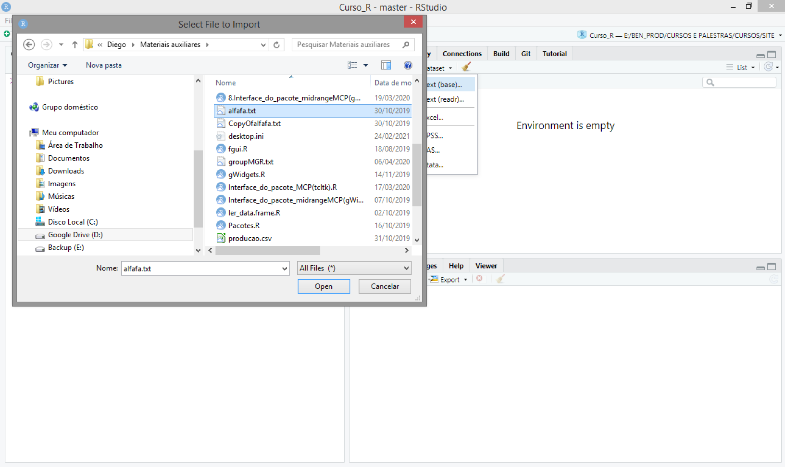
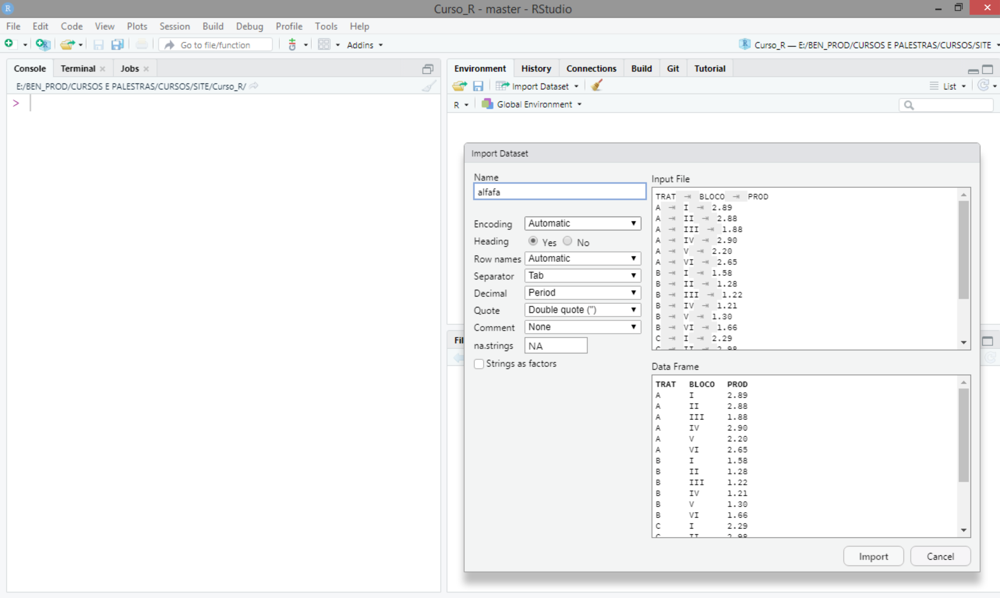

```{r setup, include=FALSE}
knitr::opts_chunk$set(echo = TRUE)
```
--- 

# Objetivo

Descrever as ideias básicas sobre o ambiente R:

 - Como instalar o R e RStudio;
 - Diferenças entre o R e a IDE RStudio;
 - Como o R trabalha;
 - Comandos elementares;
 - Objetos;
 - Manipulação com objetos;
 - Importação de dados;
 - Pacotes: 
   - Instalação;
   - Como usar.

# Apresentação do relatório

Diante do objetivo do relatório apresentaremos nas próximas subseções, os pontos a serem discutidos.

## Como instalar o R e o RStudio
  - [Instalação do R](https://cran.r-project.org/bin/windows/base/)
  - [Instalação do RStudio](https://rstudio.com/products/rstudio/download/#download)


## Diferenças entre o R e a IDE RStudio
  - Ao iniciarmos o R, ele já estará pronto para linhas de comandos serem inseridas. Suas janelas se sobrepõem, esta é a principal desvantagem do R.
  - O RStudio apresenta quatro quadrantes como padrão para que fique mais fácil a utilização do R. Dessa forma, essa divisão, torna-se muito mais organizada para a realização de atividades.
  
    
   
    


## Como o R trabalha
Ele possui três princípios:

  - **Princípio do objeto**: tudo que existe em R é um objeto.
  - **Princípio da função**: tudo o que acontece no R é uma chamada de função.
  - **Princípio da interface**: interfaces para outros programas são parte do R.


   


## Comandos Elementares
Divididos em: **expressões** e **atribuições**.
  
  - **Expressões**: o R avalia a expressão e imprime o resultado. Caso apareça mensagens indicando "erro", significa que algum elemento inserido na função não foi reconhecido pelo R.
  
  `8 + 9`
  
  `[1] 17`

  - **Atribuições**: um nome é relacionado a um objeto, podendo ser recuperado.
  
  ` meu nome <- "Ana Flavia"`
  
  `[1] Ana Flavia`

É importante lembrar que se o comando inicia com o símbolo **#**, significa que temos um comentário, o qual é apenas impresso na tela.

  - **Execução de comandos**
  Podemos inserir o comando de duas formas, uma linha por vez ou, se for na mesma linha, sepramos por **;**.
  
  `meu nome <- "Ana Flavia" #Criamos e associamos um nome ao objeto 
  meu nome #Imprimimos o objeto`
  
  
  `#Tudo em uma linha 
  meu nome <- "Ana Flavia"; meu_nome`
  
  
  Caso o comando desejado seja muito grande, e não cabe em apenas uma linha, utilizamos o símbolo **+** após a primeira linha  utilizada. 

  - **Chamada e correção de comandos anteriores**
    - Para recuperar um comando: teclas das setas para cima e para baixo.
    - Alterar caracteres: teclas das setas para direita e para esquerda.
    - Remover caracteres: _delete_ ou _backsapce_ do teclado.
    
## Objetos
Reconhecemos um objeto como uma entidade no ambiente R cujas características internas contêm as informações necessárias para explicar sua estrutura e conteúdo. Características essas que são nomeadas atributos.

  - **Associando um nome a um objeto**

    > x <- 9
    
    >9 -> x

    - Atribuição de comando;
    - Utilizar: <-, ou seja, **<** + **-** ;
    - Utilizar o símbolo **=** apenas para definir argumentos de uma função;


  - **Nomes sintáticos e Não sintáticos**

    - Letras, dígitos, **.** e _ ;
  
  - **Atributos**
  
  São um conjunto de informações que caracterizam o objeto.
  Além disso, todos os obejtos do R possuem uma **classe**, em que as funções podem ter diferentes comportamentos 
  
  - **Tipos de objetos**
    - **Vetores atômicos**:
      - Lógicos,numéricos e caracteres;
      - Matrizes unidimensionais ( _Matrix_ ) e multidimensionais ( _Arrays_);
    
    - **Vetores em lista**:
      - Listas ( _Lists_ );
      - Quadro de dados ( _Data frames_ );
      

## Manipução com objetos

### **Vetores**
  
  - Numéricos: 
    - Inteiro;
    - Real;
  - Lógico;
  - Caractere;
  
**Escalares**
  
  - Vetores lógicos assumem valores: TRUE ou FALSE;
  - Em valores especiais, chamados pontos flutuantes temos: `> Inf `, ` -Inf ` e ` NaN `;
  - Vetores númericos (`double`): respresentados de forma decima, científica ou hexadecimal;
  - Vetores numéricos (`integer`): letra **L** ao final do número inteiro (2L, 3.23L, 6L, etc );
  - Carcteres: palavras, números ou caracteres especiais são escritos entre aspas ou aspas simples ( "Ana Flavia", "G", 'Ana Flavia', 'B' );
  
**Vetores longos**

Utiliza- se a função c():
  
  `vetor.num <- c(1, 2, 3, 4, 5); vetor.num `
  
  `[1] 1 2 3 4 5`
  
O vetor de modo `double` requer mais memória que o `integer`. Porém essa função apresenta o recurso de **abreviação alternativa** que faz com que a sequência não seja armazenada por completo. Sendo assim, a ocupação de memória, para qualquer tamanho de sequência, será a mesma. 

**Matrizes Bidimensionais**

Nesse caso utilizamos um atributo chamado `dim`:

  `dim (x) <- c(2, 3) # 2 x 3 = 6 (Comp do vetor)`
  
  `# attr(x, "dim") <- c(2, 3)`
  
       
            [,1] [,2] [,3]
       [1,]    1    3    5
       [2,]    2    4    6

**Matriz Multidimensional**

A única diferença, é que neste caso temos um vetor atômico de mais de duas dimensões.

  `# Adicionando o atributo dim`
  `dim(x) <- c(2, 3, 2) # 2 x 3 x 2 = 12 (Comp do vetor)`
  `attr(x, dim) <- c(2, 3 ,2)`
  
    , , 1

            [,1] [,2] [,3]
       [1,]    1    3    5
       [2,]    2    4    6

    , , 2

            [,1] [,2] [,3]
       [1,]    7    9   11
       [2,]    8   10   12
  

## Importação de dados
O primeiro passo para a importação é fazer uma preparação, por isso seguimos alguns padrões: 
  
  - Evitar símbolos fora do padrão afanumérico;
  - Evitar misturas de letras maiúsculas e minúsculas, sempre lembrando dos padrões de nomenclatura do R;
  - Deixar a formatação da apresentação de dados em arquivos específicos, por isso devemos evitar comentários ou informações que não se relacionem com o banco de dados;
  - Evitar palavras longas ou compostas;
  
  **Importando Dados**
  
  - Função responsável: scan();
  
  > x <- scan()
  
  - Após isso seguiremos o seguinte passo-a-passo:
    - Depois e executarmos o comando acima e apertar ENTER aparecerá no console 1: em que devemos digitar o primeiro valor de x;
    - Para 2: digitar o segundo valor de x;
    - Seguindo assim até todos os valores de x serem colocados, ao final, apertamos duas vezes a tecla ENTER para sair do comando;


Normalmente utilizamos programas para criar o banco de dados e  depois o R fará a leitura, porém o formato desse tipo de arquivo não é compatível com o R. Uma outra maneira é realizar a importação de dados pelo próprio R , extensão _RData_.

Com o arquivo já pronto, a leitura dele pode ser feita em poucos passos:
  
  [Usando RStudio para importar dados](importacaodados.jpg)
  
  
   
  
   
  
   
  

## Pacotes

Um pacote é a unidade básica para compartilhamento de um código.
 
Quantidade: [19002](https://cran.r-project.org/web/packages/) (23/04/2022);

Tipos: _.tar.gz_, _.zip_, etc...

Onde: [CRAN](https://cran.r-project.org/mirrors.html), [GitHub](https://github.com/), etc...

O objetivo de um pacote é facilitar e otimizar atividades do dia-a-dia na utilização da linguagem [R](https://www.r-project.org/), neste caso. Ademais, a experiência de utilizar o pacote possui maior poder de disseminação.


  {width=50%}
  
  - **Instalação**
    - Via [CRAN](https://cran.r-project.org/)
     
    ` install.packpages (pkgs = "nome do pacote")`
  
  - **Como usar** 
  
  Após a instalação é necessário disponibilizar e inserir o pacote no caminho de busca, para isso utilizamos as funções `library()` ou `require()`.
  
  `library ("nome do arquivo")`
  
Para acessar as funções do pacote, utilizamos `nome_pacote::nome_função`.Faremos da seguinte maneira:
 
  `# Caminho de busca`
  
  `> search()`
  
  `# Carregando e chamando a função de um pacote`
  
  `> nome_pacote::nome_função`
  


    
  