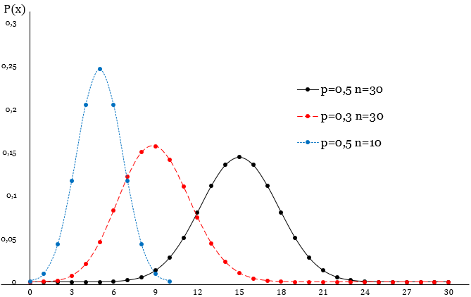
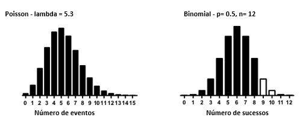
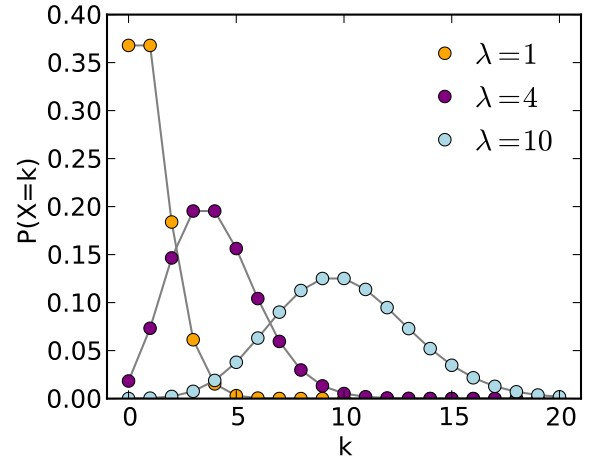
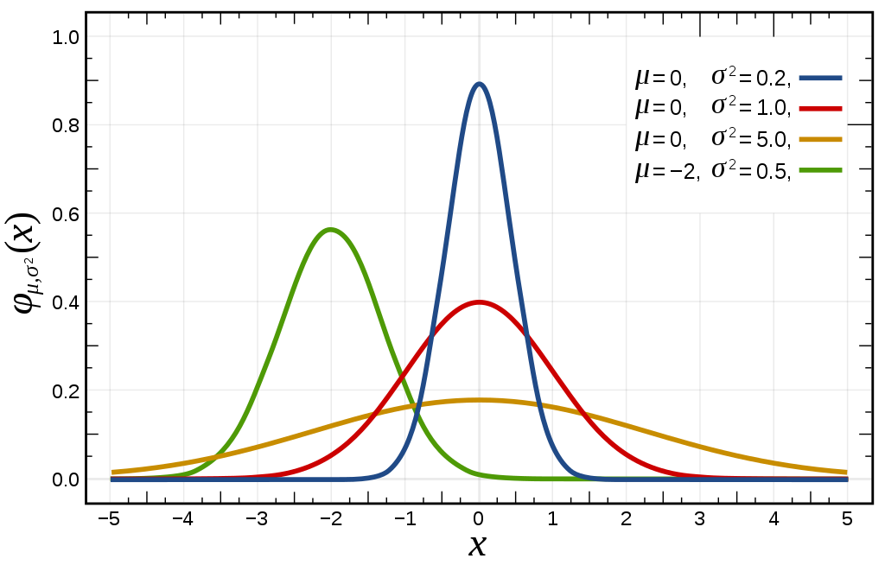

```{r setup, include=FALSE}
knitr::opts_chunk$set(echo = FALSE)
```

## Introdução

### **Espaço Amostral**
  
  - É o conjunto formado por todos os resultados possíveis de um experimento aleatório. Em outras palavras, é o conjunto formado por todos os pontos amostrais de um experimento.Como por exemplo:
  
  Dado experimento "lançamento de um dado" o espaço amostral será: S={1, 2, 3, 4, 5, 6}.
  
  - Uma distribuição de probabilidade é um modelo matemático que relaciona um certo valor da variável em estudo com a sua probabilidade de ocorrência.Há dois tipos:
  
    - **Distribuições Contínuas**
    - **Distribuições Discretas**
    
## Distribuições Discretas

  - A probabilidade de que a variável  **X**  assuma um valor específico  x  é dada por:  P(**X** = x ) = P( x )
  
  - No caso de **variáveis contínuas**, as probabilidades são especificadas em termos de intervalos, pois a probabilidade associada a um número específico é zero (não enumerável).

### **Distribuição de Bernoulli**

  - Este modelo probabilístico é caracterizado da seguinte forma:
  
  x=1 sucesso, P(x=1) = "p" (sucesso)
  
  x=0 fracasso, P(x=0) = 1 - p (fracasso)
  
  $P(X=x) = p^x*(1-p)^(1-x)$
  
## Distruibuições Discretas

### **Distribuição de Bernoulli**
  
```Script:
  # Valores
  n <- 10000; x <- 0:n; p <- 0.459394
  # Probabilidade
  px <- dbinom (x, size = n, prob = p)
  # Gráfico
  plot (x, px, type = "h", xlab = "X", ylab = expression("P(X = x)"),
  planel.first = grid(col="gray"), ylim = c(0, 0.008), xlim = c(4400, 
  4800), (lwd = 3)

```
 
## Distruibuições Discretas

### **Distribuição Binomial**

  - Características:
    - Uma distribuição binomial fica caracterizada pelos parâmetros *n* e *p*.
    - Para qualquer *n*, a distribuição será simétrica, se *p* = *q* = 0, 5, será assimétrica à direita, se *p* > *q*, e assimétrica à esquerda, se *p* < *q*.
    - Para um determinado valor *p*, à medida que *n* a distribuição Binomial se torna cada vez mais simétrica.
    
## Distruibuições Discretas
### **Distribuição Binomial**

```
# Consideramos a alteracao do valor do parametro p
# Grafico da distribuicao binomial para n = 30 e p = 0.5
x <- 0:30; n <- 30; p <- 0.5
 px <- dbinom(x, size = n, prob = p)
 plot(x, px, type = "h", xlab = "X", ylab = expression("P(X=x)"), 
 panel.first
= grid(col="gray"), ylim = c(0, 0.5), lwd = 2)

# n = 30 e p = 0.3
x <- 0:30; n <- 30; p <- 0.3
 px <- dbinom(x, size = n, prob = p)
 lines(x, px, col = "red", type = "h", lwd = 2)

# n = 10 e p = 0.5
x <- 0:100; n <- 10; p <- 0.5
 px <- dbinom(x, size = n, prob = p)
 lines(x, px, col = "green", type = "h", lwd = 2)
 

```
## Distruibuições Discretas
### **Distribuição Binomial**

  <center>
  {width=50%}
  </center>
  
  $E[X] = np$ (Esperança);
  
  $σ ^ 2x = np(1 − p)$ (Variância);
  
  $σx =(np(1 − p)) ^1/^2$ (Desvio Padrão);


  
## Distruibuições Discretas

### **Distribuição Poisson**

Uma variável aleatória X discreta, tem distribuição Poisson , se sua função de probabilidade é dada por

$P(X = x) = (e^(−λ) *λ^x)/x!$, para x = 0, 1, 2,...,
          
           
pode ser igual a 0,caso contrário, em que λ > 0. Em notação, X ∼ Poisson(λ) representa que X tem distribuição Poisson com parâmetro λ.

  <center>
  {width=50%}
  </center>
  
## Distruibuições Discretas

### **Distribuição Poisson**
```
# Grafico da distribuicao poisson para lambda=5
 x <- 0:10; lambda = 1
 px <- dpois(x, lambda = lambda)
 plot(x, px, type = "h", xlab = "X", ylab = expression("P(X=x)"), panel.first
= grid(col="gray"), ylim = c(0, 0.2), xlim = c(0, 10), lwd = 2)
# n = 10 e lambda = 4
 x <- 0:10; lambda = 4
 px <- dpois(x, lambda = lambda)
 lines(x+0.2, px, col = "red", type = "h", lwd = 2)
# n = 10 e lambda = 10
 x <- 0:10; lambda = 10
 px <- dpois(x, lambda = lambda)
 lines(x+0.4, px, col = "green", type = "h", lwd = 2)
 


```

## Distruibuições Discretas

### **Distribuição Poisson**
  <center>
  {width=50%}
  </center>

  $µx = E[X] = λ$ (Esperança);
  
  $σ^2x = Var[X] = λ$ (Variância);
  
  $σx =√λ$ (Desvio Padrão);

## Distribuições Contínuas

### **Distribuição Normal**

  - A distribuição Normal é em forma de sino, unimodal, simétrica em relação à sua média e tende cada vez mais ao eixo horizontal à medida que se afasta da média.
  
  - A probabilidade de uma variável aleatória tomar um valor entre dois pontos quaisquer é igual à área compreendida entre esses dois pontos.
  
  - Caracterizada por duas variáveis: **média** e **desvio padrão**.
  
     $fx(x)=(1/√2πσ^2)*e^−1/2((x−μ)/σ)^2$

## Distribuições Contínuas

### **Distribuição Normal**
  <center>
  {width=50%}    
  </center>
  
### No R:
  
  `dnorm () -> fx`
  
  `pnorm () -> fx(x)`
  
  `qnorm () -> f^-1 (p)`
  
  `rnorm ()`
  
  
  
     
  
  


  


