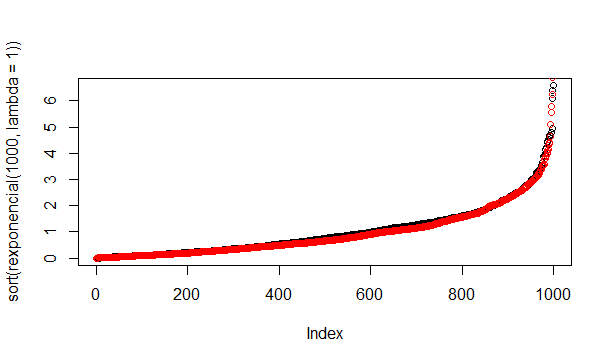

```{r setup, include=FALSE}
knitr::opts_chunk$set(echo = TRUE)
```
--- 


# Objetivo

Descrever métodos para aproximação de distribuições e geradores de números:

  - Gerar amostras de uma população
  - Quadratura Gaussiana
  - Método de Newton-Raphson
  

# Apresentação do relatório


## Gerar amostras aleatória de uma população

A seguir será mostrado como gerar, aleatóriamente, amostras de uma população. Mas em primeiro lugar é importante trazermos algumas definições.

### População

É o conjunto de elemntos para os quais desejamos que as conclusões de uma pesquisa sejam válidas, com restrição de que esses elementos possam ser observados sob as mesmas condições.
A população pode ser **finita** ou **infinita**. Ela será **finita** quando seus elementos podem ser enumerados. Já para a população **infinita** ocorre o contrário, seus elementos não podem ser enumerados. 

### Amostra 

São pequenos grupos escolhidos da população, afim de representarem as caracteristicas da população.
Amostragem é o ato de analisar uma parte do evento observado com o intuito de saber como a população se comporta, sem necessariamente analisar a população como um todo.

No R Utilizamos diversos comandos para gerar tais amostras aleatóriamente:

```
  rnorm()
  rexp()
  rgamma()
  rgumbel()
  rweibell()
  rSMR()

```
```

# Gerando numeros aleatorios de uma distribuicao exponencial

rexponencial <- function(n, lambda) {
  if (!is.numeric(lambda) | lambda < 0) 
    stop("O argumento lambda deve ser numérico e maior que 0!", call. = FALSE)
  nunif <- runif(n)
  x <- (-log(1 - nunif)) / lambda
  return(x)
}

```
```

# Verificando graficamente
plot(sort(rexponencial(1000, lambda = 1)))
points(sort(rexp(1000, rate = 1)), col = "red")


```
<center>

</center>

## Quadratura Gaussina

### Introdução 

  - ADICONAR FÓRMULA (INTEGRAL)

Devemos seguir dessa forma:
  
  -  Determinar o número de pontos s que se deve tomar para resolver a integral, segundo o polinômio *ps(x)*;
  - Determinar os nós (xk) e os pesos (wk) da quadratura, usando função:
```
SMR:::GaussLegendre(s)

```
  - Determinar *g(xk) = f(xk)*, isto é, a função de interesse aplicada nos nós *(xk)*;
  - Calcular a integral;
  
### Transformação dos limites de integração

```

>(x <- SMR:::GaussLegendre(2))
$nodes
[1] -0.5773503 0.5773503
$weights
[1] 1 1
> fx3 <- function(x) (1.5 * x + 1.5)^2 # para x^3 [0, 2]
> # Para fx3 temos
> 1.5 * sum(x$weights * fx3(x$nodes))
[1] 9


```
## Método de Newton-Raphson
