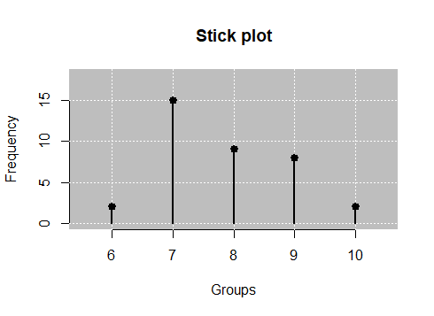
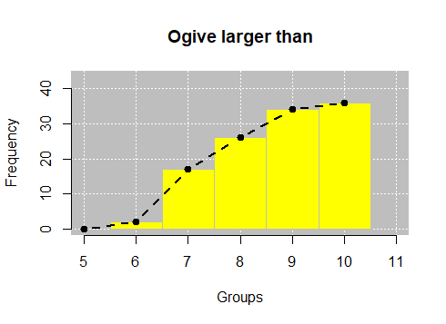
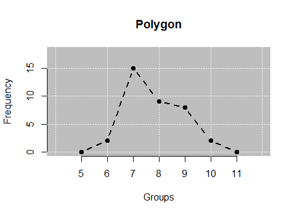
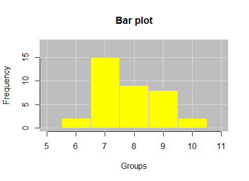

```{r setup, include=FALSE}
knitr::opts_chunk$set(echo = TRUE)
```
--- 


# Objetivo
 Descrever o processo de criação de gráficos da estatística descritiva no pacote leem.
 
# Apresentação do relatório
Abaixo segue as características dos tipos de gráficos 

# Gráficos na estatística descritiva

## Stickplot 

<center>
{width=50%}
</center>

O gráfico apresentado é do tipo (?).

Para que ele seja acessado no pacote leem, utiliza-se o comando abaixo:
```
y |> new_leem(variable = "discrete") |> tabfreq() |> stickplot()

```
Os argumentos usados nessa função são: 

  - `X`
  - `bg = TRUE`
  - `main = NULL`
  - `xlab = NULL`
  - `ylab = NULL`
  - `panel.first = grid(col="white")`
  - `bgcol = "gray"`
  - `bgborder = NA`
  - `lcol = "black"`
  - `pccol = lcol,pty = 19`
  - `pwd = 3`
  - `lty = 1`
  - `lwd = 2`

## Ogive 

<center>
{width=50%}
</center>

Ogive é um tipo de gráfico de histogramas, parecido com o de barras. Porém, o cálculo exigido é feito pela área do retângulo representado no gráfico e representa dados quantitativos. Esses dados são agrupados em classes de frequência, de modo que é possível distinguir a forma, o ponto central e a variação da distribuição dos mesmos, além de amplitude e simetrai da distribuição. 

No pacote leem, ele é acessado por tal comando:
```
y |> new_leem(variable = "discrete") |> tabfreq() |> ogive(bars = TRUE, decreasing = FALSE)

```

Abaixo segue os argumentos da função: 

  - `X`
  - `decreasing = TRUE`
  - `both = FALSE`
  - `bars = FALSE`
  - `histogram = FALSE`
  - `bg = TRUE`
  - `main = NULL`
  - `xlab = NULL`
  - `ylab = NULL`
  - `panel.first = grid(col="white")`
  - `bgcol = "gray"`
  - `bgborder = NA`
  - `barcol = "yellow"`
  - `<...truncated...>`
  
## Polygon

<center>
{width=50%}
</center>

Polygon é o tipo de gráfico representado por segmentos ou linhas, utilizado para mostrar o progresso de valores de uma variável no transcorrer do tempo. São indicados para representar sequências de dados em uma escala de tempo dividida em períodos iguais. 

Seu comando é:
```
y |> new_leem(variable = "discrete") |> tabfreq() |> polyfreq(bars=FALSE)

```
Os argumentos utilizados são: 

  - `X`
  - `type = "b"`
  - `bars = TRUE`
  - `bg = TRUE`
  - `main = NULL`
  - `xlab = NULL`
  - `ylab = NULL`
  - `panel.first = grid(col="white")`
  - `gridcol = "lightgray"`
  - `bgcol = "gray"`
  - `bgborder = NA`
  - `barcol = "yellow"`
  - `barborder = "gray"`
  - `<...truncated...>`
  
## Bar plot 

<center>
{width=50%}
</center>

Também conhecido como gráfico de colunas, ele aponta barras em tamanhos proporcionais aos valores que as representam. Além disso, demonstram dados de uma tabela de frequências referentes à uma variável qualitativa. Cada barra retangular mostra a frequência ou a frequência relativa da respectiva opção da variável.

O comando aplicado ao gráfico é:
```
y |> new_leem(variable = "discrete") |> tabfreq() |> hist()

```

Para a função, utilizamos os seguintes argumentos:

  - `X`
  - `bg = TRUE`
  - `main = NULL`
  - `xlab = NULL`
  - `ylab = NULL`
  - `panel.first = grid(col="white")`
  - `bgcol = "gray"`
  - `bgborder = NA`
  - `barcol = "yellow"`
  - `barborder = "gray`